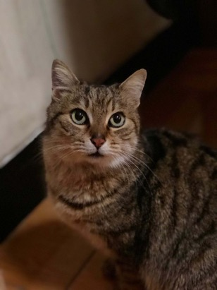

## Cluster analysis

```{r,message=FALSE,warning=FALSE}
library(ISLR)
library(factoextra)
library(tidyverse)
```

Input data.

```{r}
head(USArrests)
```

### Question a

The clustering results and plot are shown below. As dependency package "fpc" need higher version of R, we use another way to plot results.

```{r,fig.width=10, fig.height=6}
hc1.complete <- hclust(dist(USArrests), method = "complete")
# vector of colors labelColors = c('red', 'blue', 'darkgreen', 'darkgrey',
# 'purple')
labelColors = c("#CDB380", "#036564", "#EB6841", "#EDC951")
labelColors = c('orange', 'brown', 'darkgreen','purple')
# cut dendrogram in 4 clusters
clusMember = cutree(hc1.complete, 3)
# function to get color labels
colLab <- function(n) {
    if (is.leaf(n)) {
        a <- attributes(n)
        labCol <- labelColors[clusMember[which(names(clusMember) == a$label)]]
        attr(n, "nodePar") <- c(a$nodePar, lab.col = labCol)
    }
    n
}
# using dendrapply
hcd1 = as.dendrogram(hc1.complete)
clusDendro = dendrapply(hcd1, colLab)
# make plot
plot(clusDendro, main = "Cluster Dendrogram")
```

### Question b

```{r}
ind3.complete <- cutree(hc1.complete, 3)

# first cluster
USArrests[ind3.complete == 1,] %>% rownames()
# second cluster
USArrests[ind3.complete == 2,] %>% rownames()
# third cluster
USArrests[ind3.complete == 3,] %>% rownames()
```

## Question c

Using hierarchical clustering after scaling.

```{r,fig.width=10, fig.height=6}
arrests_data <- scale(USArrests)
hc2.complete <- hclust(dist(arrests_data), method = "complete")
# cut dendrogram in 4 clusters
clusMember = cutree(hc2.complete, 3)
# using dendrapply
hcd2 = as.dendrogram(hc2.complete)
clusDendro = dendrapply(hcd2, colLab)
# make plot
plot(clusDendro, main = "Cluster Dendrogram")
```

## Question d

According to above two pictures, we can find that in the second plot, more than half states belong to the first cluster, before scaling, numbers of states in each clusters are closer. 

So we draw a picture to find changes of clustering results because of scaling. The color shows states' original clusters.

```{r,fig.width=10, fig.height=6}
clusMember = cutree(hc1.complete, 3)
hcd2 = as.dendrogram(hc2.complete)
clusDendro = dendrapply(hcd2, colLab)
# make plot
plot(clusDendro, main = "Cluster Dendrogram")
```

According to the plot above, we can find that scaling or not have huge influence on how the states are clustered. After scaling, even though some of them keeps in the same cluster, lots of them change to other cluster. Besides, those which are quit different might be in same cluster after scaling.

Without scaling, `Assault` and `UrbanPop` might have huge influence on clustering results as these two variables have larger scales. However, we might want results consider effects of four variables equally. In this situation, it is better to scale variables before the inter-observation dissimilarities are computed.

## PCA

```{r}
library(jpeg)
img <- readJPEG('./boss.jpg')


r <- img[,,1]
g <- img[,,2]
b <- img[,,3]

img.r.pca <- prcomp(r, center = FALSE)
img.g.pca <- prcomp(g, center = FALSE)
img.b.pca <- prcomp(b, center = FALSE)

rgb.pca <- list(img.r.pca, img.g.pca, img.b.pca)

# Approximate X with XV_kV_k^T
compress <- function(pr, k)
{
  compressed.img <- pr$x[,1:k] %*% t(pr$rotation[,1:k])
  compressed.img
}
```

```{r}
# Using first 50 PCs
pca50 <- sapply(rgb.pca, compress, k = 50, simplify = "array")
writeJPEG(pca50, "pca50.jpeg")


# Using first 100 PCs
pca100 <- sapply(rgb.pca, compress, k = 100, simplify = "array")
writeJPEG(pca100, "pca100.jpeg")


# Using first 200 PCs
pca200 <- sapply(rgb.pca, compress, k = 200, simplify = "array")
writeJPEG(pca200, "pca200.jpeg")

```

According to pictures below, we can find that 50 pcs are enough for reconstruct the image well but 100 pcs perform better. The difference between pictures reconstructed by 100 pcs and 200 pcs are not very large.